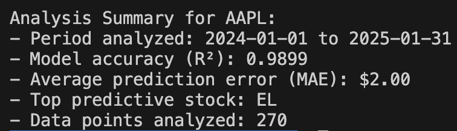

# S&P Stock Price Analysis & Forecasting 


This project analyzes historical stock prices of S&P 500 companies and uses machine learning to predict future stock prices. The project utilizes Python, Pandas, Matplotlib, and the Random Forest algorithm to process and forecast stock data. The data is retrieved from Yahoo Finance and stored in an SQLite database for efficient querying and analysis.

## Features
- **Stock Data Retrieval**: Fetches historical stock data for S&P 500 companies from the Yahoo Finance API
- **Data Processing & Visualization**: Cleans and visualizes stock price trends using Pandas and Matplotlib
- **Machine Learning Model**: Implements a Random Forest model to predict stock prices based on historical data
- **Database Storage**: Stores stock data in an SQLite database for efficient querying and storage
- **Model Evaluation**: Evaluates the model performance using Mean Absolute Error (MAE) and R-squared (R²)

## Requirements 
- Python 3.x
- yfinance library for fetching stock data
- pandas library for data manipulation
- matplotlib library for plotting
- scikit-learn library for machine learning
- sqlite3 library for database management

## Installation 
1. Clone this repository: 
```bash
git clone https://github.com/kimon222/stock-market-prediction.git
```

2. Install dependencies: 
```bash
pip3 install yfinance pandas numpy matplotlib scikit-learn
```

## How to use   
1. Run the save to sql script:
```bash
python3 save_to_sql.py
```

- Fetches and cleans stock data.
- Stores data in SQLite database (sp500_stocks.db)

---

2. Run the stock analysis script:
```bash
python stock_analysis.py
```

- Fetches historical stock data for S&P 500 companies.
- Cleans the data by handling any missing values.
- Trains a Random Forest model to predict stock prices.
- Visualizes actual vs predicted stock prices.

## Files
- `stock_analysis.py`: Main script for analyzing and forecasting stock prices using machine learning.
- `save_to_sql.py`: Script for downloading stock data and saving it into an SQLite database.
- `sp500_stocks.db`: SQLite database containing stock price data.
- `requirements.txt`: List of Python libraries required to run the project.

## 📈 Demo
<p align="left">
  
</p>  

**Explanation ^^**
- Apple's stock behavior was observed from 01/01/2024 - 01/31/2025
- R-Squared (R²) and Mean Absolute Error (MAE) are indicators of the model's accuracy,
- R-Squared (R²) shows how well the model predicts the data. 1 = perfect prediction. ours is 0.9899
- MAE shows how much the predicted stock price differs from the actual stock price, so the lower the better
- "Top predictive stock: EL" means the model predicts that the stock with the best performance will be Estée Lauder - The model thinks EL has the best potential based on provided data
- Model looked at 270 days worth of historical stock prices to make its predictions

<br/>

<p align="left">
  
</p>  

**Top Graph**
- Top graph shows Actual vs Predicted APPL Stock Price over the selected time period (01/01/2024 - 01/31/2025)
- Light blue: Actual APPL price 
- Dark blue: Predicted APPL price 

**Bottom Graph**
- These are the features (stocks) that our model used to predict our target stock (in this case, APPL)
- MSI is showing up as the most important feature (stock) because its stock price and data is strongly influencing the prediction of our target stock (APPL)
- The model learned that MSI's stock movements are a good indicator for predicting our target stock (APPL)
