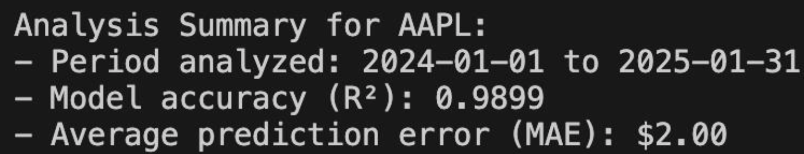
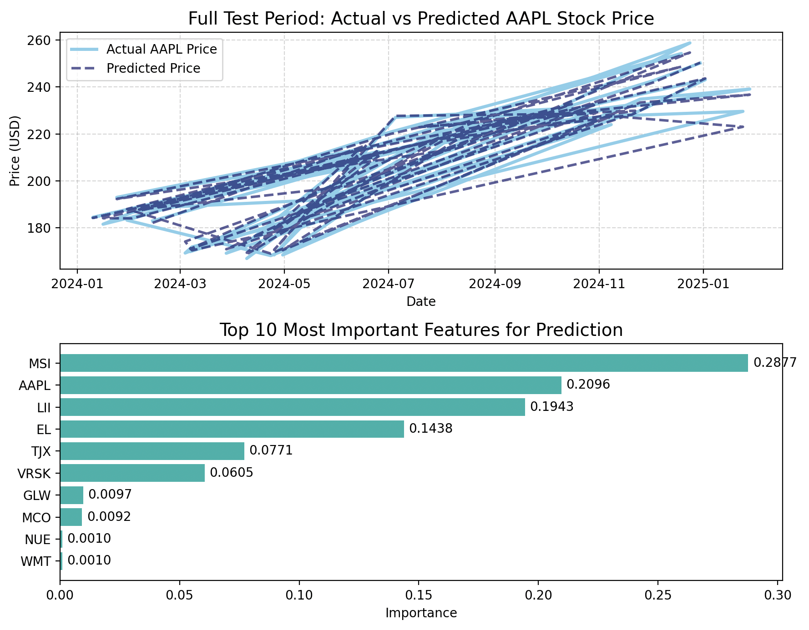

# S&P Stock Price Analysis & Forecasting 


This project analyzes historical stock prices of S&P 500 companies and uses machine learning to predict future stock prices. The project utilizes Python, Pandas, Matplotlib, and the Random Forest algorithm to process and forecast stock data. The data is retrieved from Yahoo Finance and stored in an SQLite database for efficient querying and analysis.

## Features
- **Stock Data Retrieval**: Fetches historical stock data for S&P 500 companies from the Yahoo Finance API
- **Data Processing & Visualization**: Cleans and visualizes stock price trends using Pandas and Matplotlib
- **Machine Learning Model**: Implements a Random Forest model to predict stock prices based on historical data
- **Database Storage**: Stores stock data in an SQLite database for efficient querying and storage
- **Model Evaluation**: Evaluates the model performance using Mean Absolute Error (MAE) and R-squared (R²)

## Requirements 
- Python 3.x
- yfinance library for fetching stock data
- pandas library for data manipulation
- matplotlib library for plotting
- scikit-learn library for machine learning
- sqlite3 library for database management

## Installation 
1. Clone this repository: 
```bash
git clone https://github.com/kimon222/stock-market-prediction.git
```

2. Install dependencies: 
```bash
pip3 install yfinance pandas numpy matplotlib scikit-learn
```

## How to use   
1. Run the save to sql script:
```bash
python3 save_to_sql.py
```

- Fetches and cleans stock data.
- Stores data in SQLite database (sp500_stocks.db)

---

2. Run the stock analysis script:
```bash
python stock_analysis.py
```

- Fetches historical stock data for S&P 500 companies.
- Cleans the data by handling any missing values.
- Trains a Random Forest model to predict stock prices.
- Visualizes actual vs predicted stock prices.

## Files
- `stock_analysis.py`: Main script for analyzing and forecasting stock prices using machine learning.
- `save_to_sql.py`: Script for downloading stock data and saving it into an SQLite database.
- `sp500_stocks.db`: SQLite database containing stock price data.

## 📈 Demo
<p align="left">
  
</p>  

**Explanation ^^**
- Apple's stock behavior was observed from 01/01/2024 - 01/31/2025
- R-Squared (R²) and Mean Absolute Error (MAE) are indicators of the model's accuracy,
- R-Squared (R²) shows how well the model predicts the data. This model's prediction was highly accurate, but that is because it's predicting data for the same time frame as it was trained on - instead of using previous data to predict future stock movements. 
- MAE shows how much the predicted stock price differs from the actual stock price, so the lower the better

<br/>

<p align="left">
  
</p>  

**Top Graph**
- Top graph shows Actual vs Predicted APPL Stock Price over the selected time period (01/01/2024 - 01/31/2025)
- Light blue: Actual APPL price 
- Dark blue: Predicted APPL price 

**Bottom Graph**
- These are the features (stocks) that our machine learning model used to predict our target stock (APPL)
- MSI likely influences the model's predictions for AAPL because the model has learned that MSI's performance is a good indicator of AAPL's stock movement based on historical patterns.

## 🌱 Limitations
- Traditional finance models use historical data to predict future data, in contrast to this project, which uses recent data to predict current data
- Traditional finance models include multiple groups of variables in their analysis, for example: fundamental analysis variables (earnings per share (EPS), price to earning (P/E), revenue growth, etc), technical analysis (price trends, moving averages, volume, relative strength index (RSI), etc), macroeconomic factors (interest rates, inflation rates, GDP, etc), market sentiment & external factors (investor sentiment, geopolitical events, industry trends, etc), and common predictive models (discounted cash flow, capital asset pricing model, Monte Carlo simulations, etc), in contrast to this project, which mainly observes closing prices for stocks

## 🌱 Ideas for Future Improvement
- Convert this model to use historical data to predict future data, for example by training the model on stock movements from 2018-2023, and then using the model to predict how the stock will perform in 2025
- Input more factors into the machine learning model, for example moving averages, volume, or even market sentiment, to enhance accuracy and reliability
